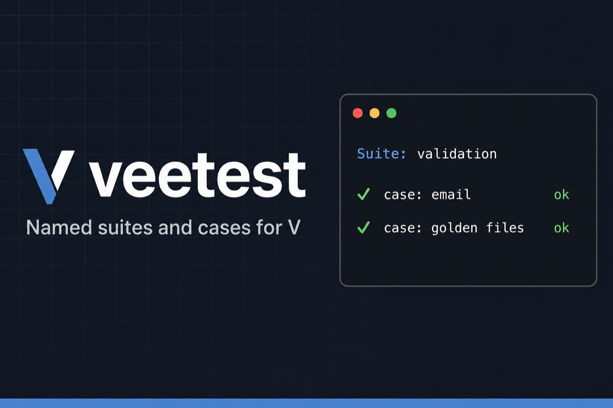

<p align="center">
  
</p>

<p align="center">
  <a href="https://github.com/franklinharvey/veetest/actions/workflows/ci.yml"></a>
  <a href="LICENSE"></a>
  <a href="v.mod"></a>
</p>

<p align="center">
  Named <strong>suites</strong> and <strong>cases</strong> for <a href="https://vlang.io">V</a> — a friendlier layer on top of the built-in <code>v test</code> runner.
</p>

## Why veetest?

V’s testing story is minimal (`test_*` functions and `assert`). veetest adds structure without replacing the runner:

- **Named suites and cases** — readable output and hierarchy (`users/http`)
- **Focused runs** — `skip`, `only`, and `VEETEST_FILTER` while developing
- **Golden files** — snapshot compare with `UPDATE_GOLDEN` and line diffs
- **CI-friendly reporters** — human output with timing, plus TAP and JSON

## Install

```bash
v install https://github.com/franklinharvey/veetest@v0.2.0
```

Add to your `v.mod`:

```v
Module {
  dependencies: ['https://github.com/franklinharvey/veetest@v0.2.0']
}
```

## Quick start

Each `_test.v` file still exposes `test_*` functions for `v test`. Inside them, run a suite:

```v
import veetest

fn test_validation() ! {
	veetest.run(veetest.suite('validation', [
		veetest.case('email', fn () ! {
			veetest.len_is('errors', errs, 1)!
		}),
	]))!
}
```

Example output:

```
Suite: validation
  email ... ok (0ms)
```

## Contents

- [Usage](#usage)
- [Parallelism and `v test`](#parallelism-and-v-test)
- [Coverage](#coverage)
- [When to use veetest](#when-to-use-veetest)
- [Commands](#commands)
- [Contributing](#contributing)
- [Roadmap](#roadmap)

## Usage

### Setup / teardown

```v
veetest.run(veetest.VeetestSuite{
	name: 'http'
	setup: start_server
	teardown: stop_server
	cases: [ ... ],
})!
```

### Per-case hooks

```v
veetest.run(veetest.VeetestSuite{
	name: 'hooks'
	before_case: reset_state
	after_case: cleanup_state
	cases: [ ... ],
})!
```

### Skip, only, and filtering

```v
veetest.skip('slow integration', fn () ! { ... }),
veetest.only('focused case', fn () ! { ... }),
```

Set `VEETEST_FILTER=substring` to run only cases whose names contain that substring. When any case is marked `only`, all other cases are skipped (a warning is printed if multiple `only` cases exist).

### Fail fast

```v
veetest.run(veetest.VeetestSuite{
	name: 'fast'
	fail_fast: true
	cases: [ ... ],
})!
```

### Table-driven cases

```v
veetest.cases_table('validate', ['empty', 'bad-email'], fn (row string) ! {
	// row is 'empty', 'bad-email', etc.
})!
```

### Golden / snapshot files

```v
veetest.golden('emit.ts', got_content, 'testdata/golden/emit.ts')!
veetest.eq_file('copy', 'out.txt', 'testdata/want.txt')!
```

To refresh fixtures: `UPDATE_GOLDEN=1 v test .`

Multiline mismatches include the first differing line in the error.

### Expect helpers

| Helper | Purpose |
|--------|---------|
| `check` | Bool assertion |
| `eq_str`, `eq_int` | Equality |
| `eq_str_diff` | String equality with line diff hint |
| `contains`, `len_is` | Substring and slice length |
| `approx_f64` | Float compare with epsilon |
| `must_err`, `must_ok` | Error-path helpers |
| `golden`, `eq_file` | Golden file compare / update |

All return `!` errors with labels.

### CI reporters and timing

Human output (default) includes per-case duration:

```
Suite: validation
  email ... ok (0ms)
```

Machine-readable output:

```bash
VEETEST_REPORTER=tap v -cc gcc test .
VEETEST_REPORTER=json v -cc gcc test .
```

## Parallelism and `v test`

- `v test` discovers `test_*` functions and may run them in parallel across a module.
- Treat each `test_*` as an isolated unit; avoid shared global mutable state between `test_*` functions.
- Cases inside `veetest.run()` always run **sequentially** in declaration order.
- Use suite names as hierarchy (`users/http`) instead of nested describe blocks.

## Coverage

Use the V toolchain for coverage (for example `v -coverage test .` where your V version supports it). veetest does not wrap coverage; it only structures cases inside existing `test_*` entrypoints.

## When to use veetest

| Approach | Best for |
|----------|----------|
| Plain `v test` + `assert` | Tiny modules, few tests |
| **veetest** | Named cases, golden files, CI reporters, focused runs — still on `v test` |
| [popzxc.vtest](https://github.com/popzxc/vtest) | Colored diff assertions around `assert` |
| [siguici.vut](https://github.com/siguici/vut) | Describe/it style, validation schemas, mocks |

veetest stays small on purpose. It does **not** provide:

- A replacement for `v test`
- Mocking / spies (use interfaces and fakes in your app)
- Property-based testing (use a dedicated module if needed)
- HTTP servers or benchmarks (add in your repo or a separate module when needed)

## Commands

```bash
v -cc gcc test .

# Focus cases while developing
VEETEST_FILTER=email v -cc gcc test .

# Update golden files
UPDATE_GOLDEN=1 v -cc gcc test .
```

## Contributing

See [CONTRIBUTING.md](CONTRIBUTING.md). Release history is in [CHANGELOG.md](CHANGELOG.md).

## Roadmap

See [TASKS.md](TASKS.md). Agents: see [AGENTS.md](AGENTS.md) for release and consumer bump workflow.
